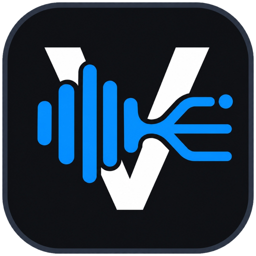

<div align="center">



# Voicer Studio
### The Choice Voicer Dialogue Extractor & Vocal Separator

[](https://www.python.org/)
[-41cd52.svg)](https://wiki.qt.io/Qt_for_Python)
[](https://pytorch.org/)
[](https://github.com/ZFTurbo/Music-Source-Separation-Training)
[](https://microsoft.com/windows)
[](LICENSE)

*An offline, studio-grade dialogue extraction and stem separation desktop application tailored for **The Choice Voicer** game dialogue pack format.*

</div>

---

## 🌟 Key Features

* **⚡ BS-RoFormer & Demucs Neural Stem Separation**:
  Isolates crystal-clear character voices while preserving all background music (BGM) and sound effects (SFX) in a lossless Backing Track. Powered by state-of-the-art `BS-RoFormer` (SDR 12.97 dB).
* **🎙️ Faster-Whisper Speech Recognition**:
  Ultra-fast local speech-to-text with specialized Thai & English dubbing prompts, sentence boundary detection, and automated hallucination filtering.
* **👥 Speaker Diarization & VAD**:
  Automated voice activity detection (Silero VAD) and multi-character speaker clustering (Pyannote Audio).
* **🎬 Multi-Track NLE Timeline**:
  Adobe-inspired dark theme timeline with draggable clips, interactive waveforms, keyboard shortcuts (`Space`, `Ctrl+Z`, `S` Split, `M` Merge, `Del`), and multi-speaker layering.
* **🚀 One-Click All-in-One "Analyze"**:
  Import a video and click **Analyze** once. The pipeline extracts audio, separates stems, slices dialogue clips (`.mp3`), captures lossless video frames (`.png`), generates `dub_video.ogv` + `dub_video.mp4`, and automatically builds the final `[PackTitle].zip` archive!
* **🖥️ Native Windows Integration & One-Click Launch (`start.bat`)**:
  Automated virtual environment management, automatic configuration initialization, native Windows 10/11 taskbar branding, and zero setup hassle.

---

## 📦 Output Pack Format — The Choice Voicer

The pipeline exports a complete, validated game dialogue pack:

```text
[Pack_Title]/
├── _pack_info.ini        ← Pack metadata (title, icon, authors)
├── _backing_track.mp3    ← Pristine backing track (BGM + SFX with vocals removed)
├── dub_video.ogv         ← Game-compatible video (Theora/Vorbis)
├── dub_video.mp4         ← Lossless source video
├── 001_Character.mp3     ← Isolated voice clip (320k MP3 with micro-fades)
├── 001_Character.png     ← Lossless video frame capture
├── 001_Character.txt     ← Dialogue cue card & timestamps
├── 002_Character.mp3
├── 002_Character.png
├── 002_Character.txt
└── ...
```

### Cue Card `.txt` Format
```ini
[data]
caption="ประโยคบทสนทนาพากย์ไทย"
image="001_Character.png"
dub_timestamps=[2.049]
dub_characters=["Character"]
```

### `_pack_info.ini` Format
```ini
[data]
title="SHANGRI LA FRONTIER"
icon="001_Character.png"
authors=["Voicer Studio"]
```

---

## 🚀 Quick Start Guide

### Prerequisites
1. **Windows 10 / 11** (64-bit)
2. **Python 3.10, 3.11, or 3.12** ([Download Python](https://www.python.org/downloads/))
3. **FFmpeg** installed and in system PATH:
   ```powershell
   winget install Gyan.FFmpeg
   ```
4. *(Optional, Recommended)* NVIDIA GPU with CUDA 12 for accelerated AI inference.

---

### Quick Start (One-Click)

1. **Clone the repository:**
   ```powershell
   git clone https://github.com/Auntonin/voicer-studio.git
   cd voicer-studio
   ```

2. **Run the application:**
   Double-click **`start.bat`** (or run `.\start.bat` in terminal).

   > [!TIP]
   > `start.bat` is fully automated:
   > - It automatically creates your local `settings.json` from `settings.example.json`.
   > - If running for the first time, it automatically sets up your Python virtual environment (`.venv`) and installs required dependencies.
   > - Then it starts Voicer Studio with full Windows taskbar icon integration.

---

## 📂 Project Architecture

```text
voicer-studio/
├── start.bat / run.bat    ← One-click automated launcher & runner
├── setup.bat / setup.ps1  ← Standalone environment installer script
├── main.py                ← Application entry point & Adobe-style Splash Screen
├── config.py              ← Studio settings, color palette & constants
├── requirements.txt       ← Python dependencies
├── settings.example.json  ← Template user settings (auto-copied on first run)
├── test_core.py           ← Core validation and unit test suite
│
├── assets/                ← Official application brand assets
│   ├── app_icon.ico       ← Multi-resolution Windows application icon
│   └── app_icon.png       ← High-resolution studio logo
│
├── core/                  ← Processing Engine & AI Pipelines
│   ├── separator.py       ← BS-RoFormer stem separation (vocal & BGM isolation)
│   ├── transcriber.py     ← Faster-Whisper transcription & sentence segmentation
│   ├── diarization.py     ← Pyannote speaker clustering
│   ├── vad.py             ← Silero VAD speech detection
│   ├── audio_extractor.py ← FFmpeg stream extraction & audio probing
│   ├── clip_generator.py  ← Frame-accurate audio slicing & fade processing
│   ├── frame_extractor.py ← OpenCV frame selection (motion & brightness filter)
│   ├── pack_builder.py    ← File generation (.ini, .txt, .ogv, .mp4, .zip)
│   ├── quality_checker.py ← Pre-export integrity verification
│   └── models.py          ← Data structures & undo/redo state manager
│
├── gui/                   ← PySide6 Studio Interface
│   ├── main_window.py     ← Adobe-minimalist NLE workspace & menus
│   ├── video_panel.py     ← Synchronized video preview player & drop area
│   ├── timeline_widget.py ← Multi-track interactive audio timeline
│   ├── dialogue_table.py  ← Dialogue clip table with inline editing
│   ├── clip_editor.py     ← Waveform zoom, caption & speaker editor
│   ├── speaker_panel.py   ← Speaker management & color coding
│   ├── pack_info_panel.py ← Game pack metadata editor
│   ├── progress_panel.py  ← Real-time processing logs & progress meters
│   ├── settings_dialog.py ← AI model & hardware preferences dialog
│   └── preview_dialog.py  ← Pre-export pack inspection modal
│
├── assets/                ← Application brand icons & references
│   ├── app_icon.png       ← 512x512 transparent brand icon
│   ├── app_icon.ico       ← Multi-size Windows application icon
│   ├── logo_reference.jpg ← Master logo artwork reference
│   └── generate_icon.py   ← High-quality icon generator script
│
└── models/                ← Model cache directory (ignored by git)
```

---

## 🔑 Hugging Face Token (Optional)

Speaker Diarization (Pyannote) requires accepting user agreements on Hugging Face:
1. Create a free account at [huggingface.co](https://huggingface.co)
2. Accept the model license at [pyannote/speaker-diarization-3.1](https://huggingface.co/pyannote/speaker-diarization-3.1)
3. Generate an access token at [huggingface.co/settings/tokens](https://huggingface.co/settings/tokens)
4. Open **Settings** in Voicer Studio and paste your token.

---

## 📄 License

This project is licensed under the MIT License — see the [LICENSE](LICENSE) file for details.
